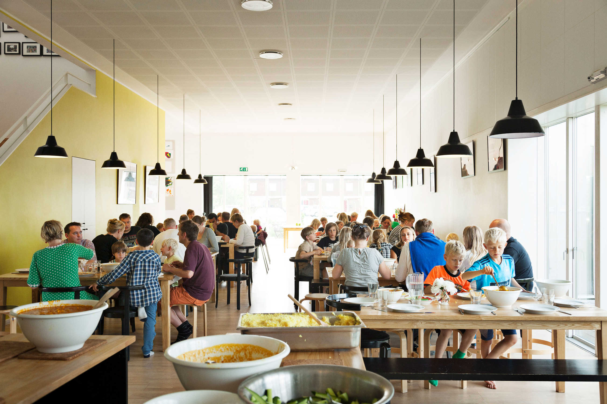

_EVA-Lanxmeer, Cuemborg (NL)_

Mi sono trovata spesso a ripensare alla bellissima esperienza che ho avuto modo di vivere nei Paesi Bassi, dove con [**Studio Pekka**](http://www.studiopekka.nl/) e [**Archi3o**](https://archi3o.nl/) ho collaborato alla nascita di un progetto di cohousing partecipativo sostenibile ([Soesterhof CPO Amersfoort](https://www.soesterhof.nl)). Fu una vera impresa arrivare ad un progetto definitivo, tuttavia una grande soddisfazione. Un po’ come riuscire ad incastrare tutti i pezzi di un puzzle.

I vantaggi del vivere in condivisione, infatti, sono moltissimi e oltre a far bene al portafogli, fanno bene anche allo spirito. Questo tipo di progettazione “collettiva” permette di **ridurre i costi di produzione**, in quanto molti dei materiali e degli elementi costruttivi vengono usati in serie o comunque in quantità maggiori rispetto ad una residenza unifamiliare, oltre a dare l’**opportunità di condividere spazi e oggetti** -come ad esempio un’asciugatrice, una piscina, un taller di bricolage- permettendo cosí di disporre di più metri quadri complessivi e di più comodità.

Il concetto di cohousing nasce alla fine degli anni ’60 in Danimarca, dal progetto di un architetto e uno psicologo, successivamente si espande nel nord Europa e negli anni ’90 arriva negli Stati Uniti con discreto successo. Da qualche anno sta prendendo piede rapidamente anche nei Paesi del centro e sud Europa. Però cosa differenzia questo processo da una normale comunità di vicini? Molto spesso chi decide di intraprendere un progetto partecipativo come residente, istituisce una vera e propria **associazione o collettivo**, che viene registrata e detiene legalmente la proprietà dell’opera. Esiste anche la possibilità di essere titolare della propria abitazione e coproprietario degli spazi comuni. La differenza principale sta, quindi, nel processo di ideazione del progetto, a livello concettuale, economico e progettuale, in cui i futuri _cohousers_ sono protagonisti. A livello di interazione sociale il cohousing può avere varie sfaccettature: generalmente non vi è una gerarchia, piuttosto un’**organizzazione orizzontale**, in cui le decisioni vengono prese in modo collettivo. Nella maggior parte delle esperienze si descrive come collante essenziale il “pasto condiviso”, una o due volte a settimana o una volta al mese, in cui tutti si ritrovano e a turno si cucina nella sala comune. Oppure l’organizzazione di attività di giardinaggio nel giardino comune, feste di compleanno o una serata cinema. Non ci sono obblighi, solamente la voglia di **condividere dei valori** e di passare del tempo assieme.

_Lilac cohousing, Leeds (UK)_

_Lilac cohousing pianta, Leeds (UK)_

Ascoltando la TED Talk di Trish Becker-Hafnor “Cohousing: the future of community and human connection” mi sono soffermata su aspetto davvero interessante: la speaker fa notare come il cohousing crei naturalmente spazi in cui le persone sono portate a socializzare. Per intenderci, vengono messe nella condizione di incontrare con una certa **frequenza** i propri vicini e in questo modo condividere un pensiero o fare una chiacchierata spontanea. Nella vita di tutti i giorni, certamente ci sono altri luoghi in cui questo avviene, anche se non è valido per tutti. I cambiamenti nelle nostre abitudini culturali o lavorative stanno riducendo la naturale creazione di situazioni di socializzazione. Non è quindi raro sperimentare sentimenti di **solitudine** o difficoltà nell’instaurare relazioni durature. Il cohousing può essere una soluzione alla solitudine, inoltre, includendo fasce d’età molto varie, può mettere in relazione persone con stili di vita diversi, ma che sono in grado di compensarsi e aiutarsi, sviluppando così un senso di comunità e condivisione.

_Lange Eng Cohousing Community, un pasto collettivo (DK)_

L’architettura ha un ruolo molto importante nella buona riuscita di un cohousing, visto che è il mezzo con il quale si creano gli **spazi di relazione**, che devono risultare naturali e ameni. Inoltre, come accennato all’inizio, ha il compito di raccogliere tutti i desideri e i bisogni dei futuri abitanti, mescolarli e condensarli in un risultato soddisfacente per tutti e, non dimentichiamo, con un certo valore architettonico. Non si tratta, quindi, di un’impresa semplice, ma quando ne risulta un progetto di successo le conseguenze positive che può avere sono davvero innumerevoli.

_Lange Eng Cohousing Community, (DK)_

Forse la tendenza è quella di scegliere sempre più spesso questo modo di abitare, visti i numeri crescenti di progetti di cohousing, o forse evolverà in qualcosa di diverso, destinato a densità maggiori e a minor occupazione di suolo, tuttavia in questo momento storico è una valdissima alternativa per ridurre l’impatto ambientale ed economico di un progetto residenziale e ridurre gli effetti della solitudine sulla società odierna.

Alcuni progetti interessanti:

- [Lange Eng Cohousing Community (DK) – Dorte Mandrup](https://www.dortemandrup.dk/work/lange-eng-cohousing-community-denmark)
- [Lilac cohousing a Leeds (UK):](https://www.lilac.coop/)
- [Eva Lanxmeer, cohousing sostenibile a Culemborg (NL)](http://www.eva-lanxmeer.nl/)
- [BwwB CPO Boschveld a Den Bosch (NL) di Archi3o](https://archi3o.nl/portfolio/cpo_boschveld/)
- [MW2 HOOIPOLDER a Den Bosch (NL) – primo progetto di cohousing sostenibile nei Paesi Bassi (1987)](https://archi3o.nl/portfolio/hooipolder-10/)

Articoli e video:

- [_“Cohousing: the future of living?”_, di Benjamin Eysermans](https://medium.com/when-the-bao-breaks/co-housing-the-future-of-living-c2a4368a9ede)
- [TED Talk di Trish Becker-Hafnor _“Cohousing: the future of community and human connection”_](https://www.youtube.com/watch?v=s9yRwn90aBw)
- [Intervista a Pietro Cobor, presidente di Cohousing.it](https://www.wired.it/attualita/2017/10/26/andassi-vivere-cohousing/?refresh_ce=)
- [Consigli per creare un nuovo cohousing, dal Cohousing Association of the United States](https://www.cohousing.org/create-cohousing/create-it/)
