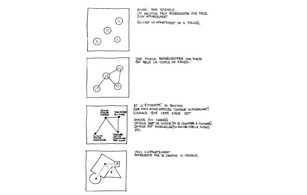
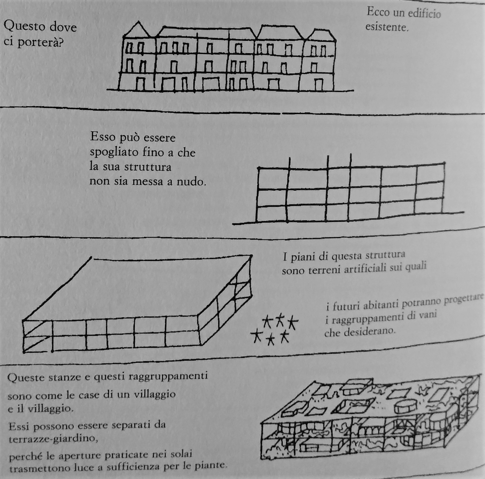
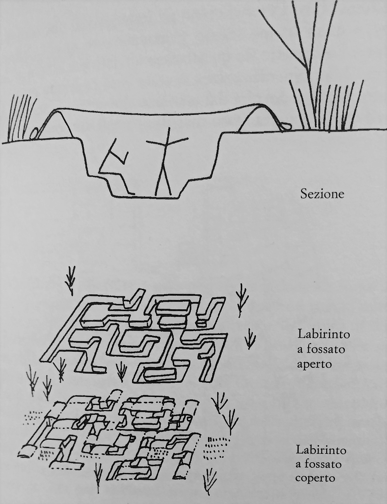
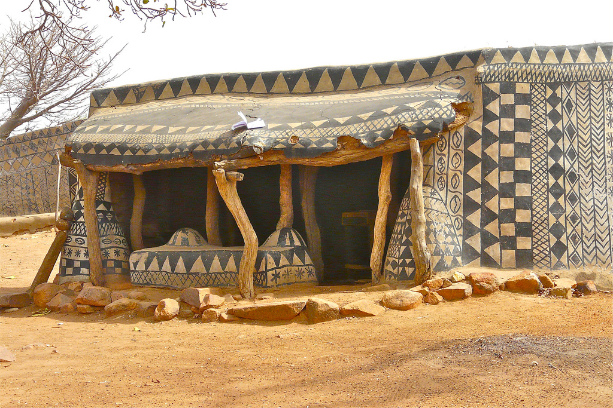

In occasione dell’anniversario dell’accordo di Parigi sull’emergenza climatica, ho pensato che fosse interessante riprendere in mano il libro di Yona Friedman _“Architettura di sopravvivenza - Una filosofia della povertà”_. È un libro non molto lungo, ma incredibilmente denso di spunti di discussione e soprattutto è un libro del 1978 (aggiornato poi nel 2002 con una nuova edizione), che sembra stato scritto l’altro ieri.

Premettendo che Friedman non si risparmia certo sulle critiche alla figura dell’architetto “creatore”, il suo punto di vista da esperto sul campo è quanto meno rivoluzionario e capace di smuovere una serie di ragionamenti sui temi trattati. Nel riassumerli, cercheró di arricchire con qualche riflessione personale.

Partendo dal presupposto che il mondo sta andando verso una impoverimento crescente, economico, ma anche di risorse e forse di valori, è necessario, se vogliamo sopravvivere, capire come dovremmo comportarci per far fronte a tale crisi nel modo più razionale possibile. Le domande che si pone lo scrittore sono: qual è il ruolo dell’**architetto**? Qual è il ruolo dell’**abitante**?

Visto che la ragion d’essere di un oggetto architettonico è servire al suo fruitore, l’abitante ha la precedenza rispetto all’architetto. Ma questo nella pratica non succede, visto che nella nostra visione comune l’architetto è alla guida del progetto e della sua costruzione, dopo aver consultato i desideri del cliente. Il problema è che l’abitante conosce i suoi desideri, ma non è in grado di spiegarli. L’architetto, che ha imparato a scuola come l’abitante (medio) dovrebbe vivere, dunque non si sforza di capire l’abitante, ma cerca di suggerirgli ciò di cui ha bisogno. Questo crea una certa frustrazione sia nell’abitante, che si fida ma non è completamente soddisfatto (e sarà lui che poi dovrà viverci), sia nell’architetto, che molto spesso percepisce l’insoddisfazione del cliente e cerca di accontentarlo con delle “toppe” sul progetto. La crisi dell’architettura è, dunque, causata dalla difficoltà di **comunicazione**.

Friedman afferma che c’è bisogno di un **linguaggio** di comunicazione e rappresentazione semplice con cui l’abitante possa creare un piano (progetto), visto che quello dell’architetto è per lui incomprensibile. Il grafo ne è un esempio (fili e bottoni): mette in relazione le stanze, ne determina l’ordine di grandezza, alcune caratteristiche e l’uso che di esse si vuole fare; può valere per la pianta di un edificio o per un intero quartiere (autopianificazione).

Fin dall’inizio del libro il ruolo dell’architetto viene messo in discussione, la figura di creativo e creatore viene direttamente scartata sulla base del postulato sulla precedenza dell’abitante come fautore dei suoi spazi. Il suo compito è dunque, secondo lo scrittore, quello di **insegnare** all’uomo comune un linguaggio con cui possa esprimersi e poi lasciare che...si esprima. Senza interferire. Inoltre, un altro suggerimento per la sopravvivenza dell’architetto, è quello delle **consulenze** su appuntamento, come in molte altre professioni, in modo totalmente facoltativo da parte del cliente.

_Esempio di grafo per rappresentare la pianta di una casa, da "L'architettura di sopravvivenza"_

Nella seconda parte del libro, l’autore mette in evidenza come l’**industrializzazione** e la **tecnologia** non siano in grado di soddisfare i bisogni primari (tetto e cibo) della popolazione mondiale in continuo aumento, tanto meno con lo stile di vita a cui siamo abituati nel mondo occidentale. Nemmeno le organizzazioni politiche ed economiche sono in grado di farlo, vista l’impossibilità di comunicazione oltre a quello che viene definito “**gruppo critico**” (Detto veramente in soldoni, un gruppo di dimensioni limitate, entro il quale è possibile la comunicazione. Oltre questa soglia è incapace di reagire velocemente a una emergenza. C’è un’intera sua pubblicazione del 1980 a riguardo: [Friedman Yona About Critical Group Size](https://it.scribd.com/document/89696493/Friedman-Yona-About-Critical-Group-Size)).

L’unica soluzione possibile è dunque l’adozione di un’**architettura di sopravvivenza**. La miglior definizione che ne viene data nel libro è probabilmente questa:

> _“l’architettura di sopravvivenza è essenzialmente il riconoscimento delle tecniche tradizionali semplici. È l’applicazione di un realismo rigoroso dell’arte di abitare la terra.”_

L’architettura di sopravvivenza facilita la produzione di cibo, l'approvvigionamento di acqua, la protezione climatica, la salvaguardia dei beni privati e collettivi, l’organizzazione dei rapporti sociali e la soddisfazione estetica di ciascuno. I suoi componenti fondamentali sono la struttura, il tetto ombrello e le divisioni leggere o mobili.

_I principai elementi dell'architettura di sopravvivenza: la struttura, il tetto forato, vani e terrazze-giardino, da "L'architettura di sopravvienza"_

Oltre ad adottare la filosofia dell’architettura di sopravvivenza, per poter far fronte alle difficoltà che ci si presenteranno, l’autore propone altre tre soluzioni:

1. **L’agricoltura urbana**, che permetterebbe di garantire la produzione di cibo all’interno della città, quindi l’indipendenza dal campo agricolo in periferia;

2. La **modificazione del regime alimentare**: considerare cibi che non siamo abituati a mangiare e altri metodi di preparazione del cibo (ad esempio fermentazione ed essiccazione) - aggiungerei come considerazione personale la riduzione del consumo di prodotti animali che, oltre ad essere più inquinanti, sono logisticamente impossibili da integrare alla città -

3. Lo spostamento della popolazione nelle **regioni a clima favorevole**, dove il tetto è l’unico elemento costruttivo essenziale.

Concludendo, Yona Friedman considera che la sopravvivenza dipenda dall’adattamento delle nostre abitudini alle necessità della natura, non viceversa. In questo senso, l’**accettazione dell’imprevisto** è fondamentale e questo è in contrasto con una pianificazione centralizzata.

> _“L’architettura che cerchiamo è quella che lascia meno tracce possibili.”_

_La città labirinto come esempio di architettura con poche risorse, da "L'architettura di sopravvivenza"_

Sono moltissimi come vediamo i temi trattati nel libro, qui si è fatto solo un riassunto di alcuni punti interessanti. Perché, dunque, ho pensato che questo libro fosse molto attuale? In primis, l’interesse crescente per il “green building” e la sostenibilità in campo architettonico riportano l’attenzione su come costruiamo, perché costruiamo, le conseguenze delle nostre scelte come architetti, ma anche come utenti e se tutto questo sia sufficiente. Purtroppo la sufficienza a mio avviso è ancora lontana, anche se la verità, probabilmente, sta nel mezzo. La fiducia nelle nuove tecnologie è assolutamente imprescindibile in un’ottica di evoluzione e progresso a cui siamo inevitabilmente chiamati, tuttavia si stanno riscoprendo le tecniche tradizionali locali per loro natura sostenibili, la necessità del recupero in una realtà urbanizzata satura dove il concetto di verde si riduce a un bosco verticale, la produzione circolare e molte altre tecniche che non sono state inventate ora, ma che anzi venivano utilizzate secoli fa per necessità. Quello che ci insegna Yona Friedman è anche a pensare in modo più umile, cercando di mettere da parte per un attimo le nostre manie di grandezza e le ultime avanguardie tecnologiche per prendere invece esempio da chi le cose le fa in modo semplice e dettato dalla “penuria”,come la definisce nel libro: i “poveri” (nel senso occidentale del termine). È molto probabile che a questo ritmo in molti dovremo progressivamente affrontare la condizione di povertà a qualche livello, allora è meglio non piangersi addosso e arrivare mentalmente preparati e attrezzati per affrontare le crisi del mondo che verrà.

_Un esempio di decorazione pittorica in un villaggio africano. Uno dei punti toccati da Friedman è quello dell'estetica dell'edificio. Egli propone come forma di abbellimento la decorazione pittorica effimera, perchè è economica e facile da sostituire_
